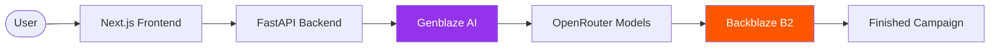
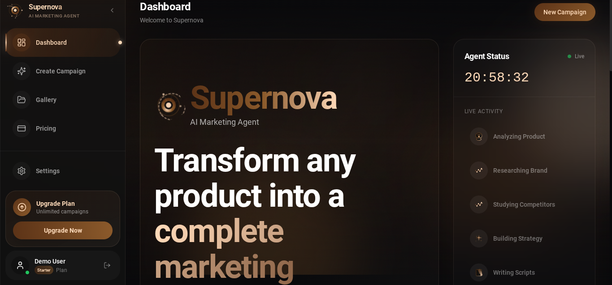
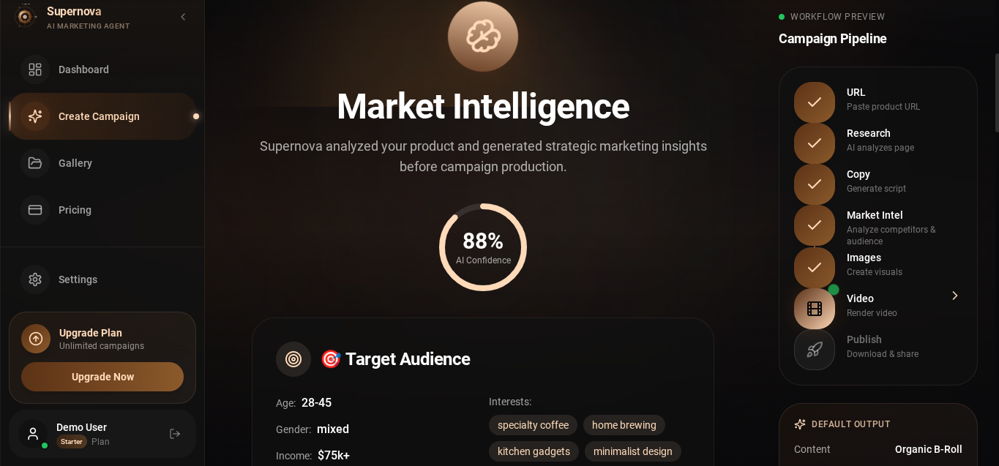
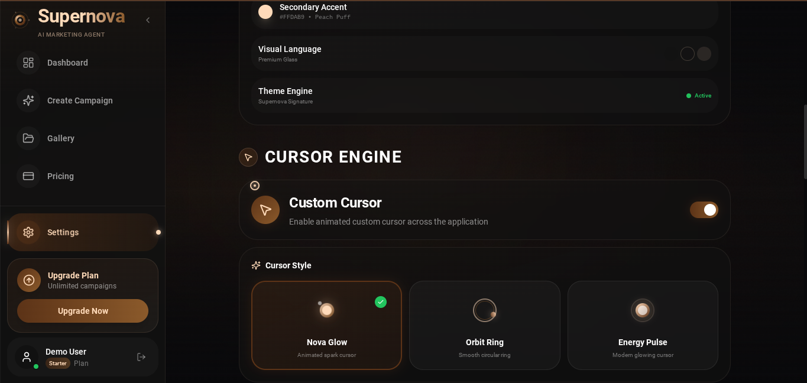
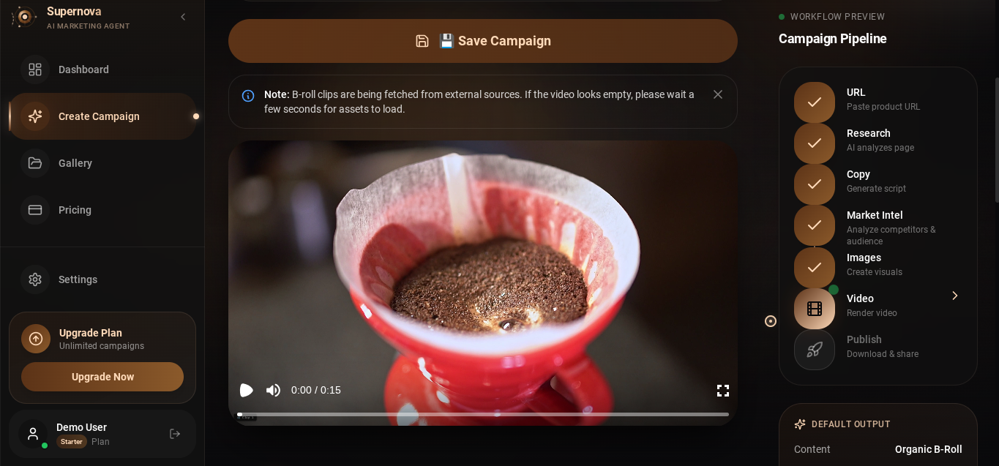

<p align="center">
  
</p>

<h1 align="center">
Supernova
</h1>

<p align="center">
  
</p>

<p align="center">
<a href="https://nextjs.org"></a>
<a href="https://react.dev"></a>
<a href="https://www.typescriptlang.org"></a>
<a href="https://fastapi.tiangolo.com"></a>
<a href="https://www.python.org"></a>
<a href="https://tailwindcss.com"></a>
<a href="https://www.framer.com/motion/"></a>
<a href="https://supabase.com"></a>
<a href="https://www.backblaze.com/b2/cloud-storage.html"></a>
<a href="https://genblaze.ai"></a>
<a href="https://openrouter.ai"></a>
<a href="https://railway.app"></a>
<a href="https://vercel.com"></a>
<a href="https://opensource.org/licenses/MIT"></a>
</p>

---

> 🏆 **Hackathon‑Born AI Innovation**
>
> Supernova demonstrates autonomous AI marketing powered by Genblaze with persistent enterprise asset storage using Backblaze B2.

---

## Live Experience

<p align="center">
<a href="https://appsupernova.vercel.app/auth"></a>
<a href="https://landing-supernova.vercel.app"></a>
<a href="https://journal-supernova.vercel.app"></a>
<a href="https://pitch-deck-supernova.vercel.app"></a>
</p>

<p align="center">
<a href="https://github.com/robloxsagax-web/Supernova"></a>
<a href="https://github.com/robloxsagax-web/supernova-landing"></a>
<a href="https://github.com/robloxsagax-web/supernova-journal"></a>
<a href="https://github.com/robloxsagax-web/supernova-pitch-deck"></a>
</p>

---

##  Judge Quick Start

```bash
Clone → Install → Configure .env → Run Backend → Run Frontend → Generate Campaign → View Gallery → Download Assets
```

**Try the entire workflow in under one minute!**

---

## Project Highlights

| Category | Value |
|----------|-------|
| **Frontend** | Next.js 15 + React 19 |
| **Backend** | FastAPI + Python |
| **API Endpoints** | 11 Routes |
| **Components** | 68 Components |
| **AI Providers** | OpenRouter + Groq |
| **Storage** | Backblaze B2 |
| **Authentication** | Supabase Auth |
| **Deployment** | Vercel + Railway |

---

## Why Supernova

> **The average marketing team uses 12+ different tools to create one campaign.**

Traditional marketing requires:

- Separate subscriptions for research, writing, design, and production
- Manual coordination between teams and tools
- Days or weeks to produce a single campaign
- Inconsistent quality across deliverables
- Expensive agency fees or in-house specialists

**Supernova unifies the entire workflow into one autonomous AI platform.** Enter a product URL and watch as Genblaze orchestrates market intelligence and script generation, while specialized APIs handle image creation, voiceover, and video assembly — all stored automatically in the cloud.

---

## The Problem

Modern businesses waste hours creating marketing campaigns. They manually:

- Research competitors
- Analyze market trends
- Write marketing copy
- Generate product images
- Record voiceovers
- Edit videos
- Organize digital assets

This workflow is fragmented across many different expensive tools and requires significant manual effort. Creating a single marketing campaign often requires subscriptions to:

- Web scraping services
- AI writing assistants
- Market research platforms
- Design software
- Video production tools
- Cloud storage solutions
- Analytics dashboards

**This approach is expensive, time-consuming, and leads to inconsistent quality.**

---

## Feature Comparison

| Traditional Workflow | Supernova |
|---------------------|-----------|
| Multiple tools & subscriptions | One unified platform |
| Manual research | AI-powered market intelligence |
| Human copywriting | AI-generated scripts |
| Professional design software | AI-generated product images |
| Manual timeline editing | Automated video composition with Remotion |
| Separate storage solutions | Integrated Backblaze B2 asset management |
---

## Our Solution

**Supernova** unifies the entire marketing campaign workflow into one AI-powered platform. Simply provide a product URL, and our autonomous AI agents handle everything else.

```
Product URL → Market Research → Competitor Analysis → AI Strategy
     ↓
Script Generation → Professional Images → Voice Generation
     ↓
Video Assembly → Campaign Storage → Ready-to-Publish
```

### What Supernova Delivers

- 🔍 **Market Intelligence** — AI-powered competitor research and trend analysis
- 📊 **Strategic Insights** — Data-driven marketing recommendations
- ✍️ **Professional Scripts** — AI-generated marketing copy
- 🎨 **Product Images** — AI-generated marketing visuals
- 🎙️ **Voice Generation** — Natural-sounding AI voiceovers
- 🎬 **Video Composition** — Timeline-based advertisement assembly with Remotion
- ☁️ **Backblaze B2 Storage** — Persistent cloud storage for campaign assets
- 📦 **Campaign Downloads** — Export campaign assets instantly
---

## AI Workflow

```
┌─────────────────────────────────────────────────────────────────┐
│                      SUPERNOVA AI PIPELINE                      │
└─────────────────────────────────────────────────────────────────┘

                          ┌──────────────┐
                          │   Product    │
                          │   Analysis   │
                          └──────┬───────┘
                                 │
                                 ▼
                    ┌─────────────────────────┐
                    │   Market Intelligence   │
                    │   • Competitor research │
                    │   • Trend analysis      │
                    │   • Positioning         │
                    └───────────┬─────────────┘
                                │
                                ▼
                    ┌─────────────────────────┐
                    │    Script Writing       │
                    │   • Marketing copy      │
                    │   • Call-to-action      │
                    │   • Brand voice         │ 
                    └───────────┬─────────────┘
                                │
                                ▼
                    ┌─────────────────────────┐
                    │ Professional Product    │
                    │ Image Generation        │
                    │   • High-quality visuals│
                    │   • Ad-optimized        │
                    │   • Brand-consistent    │
                    └───────────┬─────────────┘
                                │
                                ▼
                    ┌─────────────────────────┐
                    │   Voice Generation      │
                    │   • Natural TTS         │
                    │   • Multiple voices     │
                    │   • Audio sync          │
                    └───────────┬─────────────┘
                                │
                                ▼
                    ┌────────────────────────────┐
                    │    Video (Remotion)        │
                    │   • Auto-assembly          │
                    │   • Transitions            │
                    │   • Video Composition      │
                    │   • Remotion timeline      │
                    │   • Motion graphics        │   
                    │   • Scene composition      │
                    │   • Voice synchronization  │
                    └─────────────┬──────────────┘
                                │
                                ▼
                    ┌─────────────────────────┐
                    │      Storage            │
                    │   • Backblaze B2        │
                    │   • Asset management    │
                    │   • Version history     │
                    └─────────────────────────┘
```

### Simplified Timeline

```
Product URL → Market Intelligence → Competitor Analysis → Marketing Strategy
     ↓
Professional Script → Professional Product Images → Voice Generation
     ↓
Video Rendering → Campaign Storage → Download Ready
```

### Architecture Flow



---

## Built with Genblaze

Genblaze orchestrates the two most critical AI stages of Supernova: **script generation** and **market intelligence**. We use the official `genblaze_openai.chat()` interface and have built a production‑grade orchestration layer around it.

### Genblaze Integration

| Capability | Genblaze Integration |
|------------|---------------------|
| **Script Generation** | Multi‑model fallback cascade (Qwen → DeepSeek → Claude → Gemini) with duration‑aware prompts and automatic retry |
| **Market Intelligence** | Multi‑model research phase (DeepSeek V3, Claude, Gemini) producing structured JSON reports with competitor analysis and audience profiling |

### Why This Approach?

Genblaze currently does not offer a native text/chat provider; `chat()` is the official interface for text tasks. Instead of making a single API call, we built a full orchestration system:

- **Multi‑model fallback cascade** — if one model fails, the next takes over automatically
- **Intelligent circuit breaker** — distinguishes model‑not‑found errors (safe to retry) from auth/rate‑limit errors (fail fast)
- **Provider catalog** — centralized configuration for all AI models, making it easy to add new providers or adjust fallback priorities
- **Structured logging** — every call logs the provider, model, temperature, timing, and token usage

For image generation, voiceover, and video composition, Supernova uses dedicated best‑in‑class APIs (Puter.js, ElevenLabs, Pexels, Remotion) that are purpose‑built for those modalities. Genblaze focuses on what it does best: orchestrating the reasoning that drives the entire campaign.

---

## Powered by Backblaze B2

**Backblaze B2** provides enterprise-grade object storage for all campaign assets:

### What We Store

- 🖼️ **AI-generated Images**
- 📜 **Marketing Scripts**
- 📊 **Market Intelligence Reports**
- 🎙️ **Voice Assets**
- 📄 **Campaign Metadata**
- 📦 **Downloadable Campaign Packages**

### Why Backblaze B2

- 💰 **Cost-effective** — 75% cheaper than AWS S3
- 🔒 **Secure** — Private buckets with encryption
- ⚡ **Fast** — S3-compatible API with global CDN
- 🔄 **Reliable** — 99.9% uptime SLA

---

## Features

<div align="center">

| | | |
|:--|:--|:--|
| ✓ Market Intelligence | ✓ Competitor Research | ✓ AI Script Writing |
| ✓ Professional Product Images | ✓ Voice Generation | ✓ Remotion Video Composition |
| ✓ Campaign History | ✓ Asset Management | ✓ Secure Cloud Storage |
| ✓ Download Packages | ✓ Multi-format Export | ✓ User Authentication |

</div>

---

## Screenshots

### Dashboard


### Campaign Builder


### Analytics


### Generated Assets


### Settings


### Final Generated Advertisement


---

## Architecture

```
┌─────────────────────────────────────────────────────────────────┐
│                      SYSTEM ARCHITECTURE                        │
└─────────────────────────────────────────────────────────────────┘

                         ┌────────────┐
                         │    User    │
                         └─────┬──────┘
                               │
                               ▼
┌─────────────────────────────────────────────────────────────────┐
│                        FRONTEND (Vercel)                        │
│   Next.js 15 • React 19 • TypeScript • TailwindCSS • Framer     │
└──────────────────────────────┬──────────────────────────────────┘
                               │
              ┌────────────────┼────────────────┐
              │                │                │
              ▼                ▼                ▼
┌─────────────────┐  ┌─────────────────┐  ┌─────────────────┐
│  FastAPI        │  │  Supabase       │  │  Backblaze B2   │
│  Backend        │  │  Database       │  │  Cloud Storage  │
│  (Railway)      │  │  Auth           │  │                 │
└────────┬────────┘  └─────────────────┘  └─────────────────┘
         │
         ▼
┌─────────────────────────────────────────────────────────────────┐
│                      GENBLAZE AI LAYER                          │
│         Script Generation • Market Intelligence                 │
└──────────────────────────────┬──────────────────────────────────┘
                               │
                               ▼
                    ┌─────────────────────┐
                    │    OpenRouter       │
                    │  • Qwen 3.6         │
                    │  • DeepSeek V3      │
                    │  • Claude           │
                    └─────────────────────┘
```

---

## 🚀 Getting Started

### Prerequisites

- Node.js 18+
- Python 3.10+
- Git

### Quick Setup

```bash
# Clone the repository
git clone https://github.com/robloxsagax-web/Supernova.git
cd Supernova

# Install dependencies
npm install

# Configure environment
cp .env.example .env.local

# Start development
npm run dev
```

Visit [http://localhost:3000](http://localhost:3000)

### Environment Variables

| Variable | Description | Where to Get |
|----------|-------------|--------------|
| `NEXT_PUBLIC_SUPABASE_URL` | Supabase project URL | [supabase.com](https://supabase.com) |
| `NEXT_PUBLIC_SUPABASE_ANON_KEY` | Supabase anonymous key | Supabase Dashboard → Settings → API |
| `FASTAPI_URL` | Backend API URL | `http://localhost:8000` (local) |
| `OPENROUTER_API_KEY` | OpenRouter API key | [openrouter.ai/keys](https://openrouter.ai/keys) |
| `GROQ_API_KEY` | Groq API key | [console.groq.com](https://console.groq.com) |
| `B2_ACCESS_KEY_ID` | Backblaze access key | Backblaze Dashboard → App Keys |
| `B2_SECRET_KEY` | Backblaze secret key | Backblaze Dashboard → App Keys |
| `B2_BUCKET_NAME` | Backblaze bucket name | Backblaze Dashboard → Buckets |

### Production Deployment

See [DEPLOYMENT.md](docs/DEPLOYMENT.md) for detailed production deployment instructions.

---

## 📂 Project Structure

```
Supernova/
├── src/                      # Next.js Frontend
│   ├── app/                  # App Router Pages
│   │   ├── (app)/           # Authenticated Routes
│   │   │   ├── dashboard/   # Main Dashboard
│   │   │   ├── create/      # Campaign Builder
│   │   │   ├── gallery/     # Asset Library
│   │   │   └── settings/     # User Settings
│   │   ├── (auth)/          # Authentication
│   │   └── api/              # API Routes
│   ├── components/           # React Components
│   │   ├── dashboard/        # Dashboard Widgets
│   │   ├── premium/          # Premium UI
│   │   └── ui/               # UI Components
│   └── lib/                  # Utilities
│
├── services/api/              # FastAPI Backend
│   ├── app/
│   │   ├── routes/           # API Endpoints
│   │   │   ├── script.py              # Script Generation
│   │   │   ├── market_intelligence.py
│   │   │   └── storage.py            # B2 Storage
│   │   └── repo/              # Business Logic
│   │       ├── pipelines.py            # Genblaze Pipelines
│   │       └── provider_catalog.py     # AI Providers
│   └── requirements.txt       # Python Dependencies
│
├── docs/                     # Documentation
├── supabase-schema.sql       # Database Schema
└── package.json             # Node Dependencies
```

---

## 📚 Documentation

| Guide | Description |
|-------|-------------|
| [Getting Started](docs/GETTING_STARTED.md) | Complete setup guide |
| [Deployment](docs/DEPLOYMENT.md) | Production deployment |
| [Genblaze Integration](docs/GENBLAZE.md) | AI orchestration |
| [Backblaze B2](docs/BACKBLAZE_B2.md) | Cloud storage setup |
| [Project Structure](docs/PROJECT_STRUCTURE.md) | Codebase overview |
| [Acknowledgments](ACKNOWLEDGMENTS.md) | Credits and acknowledgments |
| [Performance](PERFORMANCE.md) | Production optimizations |

---

## Technology Stack

### Frontend
| Technology | Purpose |
|------------|---------|
| **Next.js 15** | React framework with App Router |
| **React 19** | UI library |
| **TypeScript** | Type-safe development |
| **Tailwind CSS** | Styling |
| **Framer Motion** | Animations |
| **Zustand** | State management |

### Backend
| Technology | Purpose |
|------------|---------|
| **FastAPI** | Python web framework |
| **Python 3.10+** | Backend language |
| **Genblaze SDK** | AI orchestration |

### AI & Intelligence
| Technology | Purpose |
|------------|---------|
| **Genblaze** | AI orchestration layer |
| **OpenRouter** | Multi-model AI access |
| **Groq** | Fast AI inference |

### Storage & Database
| Technology | Purpose |
|------------|---------|
| **Backblaze B2** | Cloud object storage |
| **Supabase** | PostgreSQL + Auth |

### Deployment
| Technology | Purpose |
|------------|---------|
| **Vercel** | Frontend hosting |
| **Railway** | Backend hosting |

---

## Why This Project

| | |
|:--|:--|
| ✅ **AI-Assisted Marketing Workflow** | Complete autonomous marketing pipeline |
| ✅ **Production Ready** | Deployable architecture with monitoring |
| ✅ **Persistent Backblaze B2 Asset Storage** | Backblaze B2 for persistent assets |
| ✅ **Cloud Native** | Microservices on Vercel + Railway |
| ✅ **Real AI Integrations** | Genblaze + OpenRouter + Groq |
| ✅ **Secure Authentication** | Supabase Auth with RLS |
| ✅ **Modern SaaS Architecture** | React + FastAPI + TypeScript |

---

## Production Status

| Component | Status |
|-----------|--------|
| **Frontend** | ✅ Production Ready |
| **Backend API** | ✅ Production Ready |
| **Authentication** | ✅ Implemented |
| **Cloud Storage** | ✅ Implemented |
| **Deployment** | ✅ Configured |
| **Documentation** | ✅ Complete |

---

### Core Workflow

→ ✅ Product URL
→ ✅ AI Market Intelligence
→ ✅ AI Campaign Strategy
→ ✅ AI Script Writing
→ ✅ AI Product Image Generation
→ ✅ AI Voice Generation
→ ✅ Remotion Video Composition
→ ✅ Backblaze B2 Asset Storage
→ ✅ Campaign Download

---

## Explore the Project

<p align="center">

| 🌐 Live Platform | 🚀 Landing Website | 📖 Engineering Journal | 🎤 Pitch Deck |
|:--:|:--:|:--:|:--:|
| [Main App](https://appsupernova.vercel.app/auth) | [Landing](https://landing-supernova.vercel.app) | [Journal](https://journal-supernova.vercel.app) | [Pitch Deck](https://pitch-deck-supernova.vercel.app) |
| [GitHub](https://github.com/robloxsagax-web/Supernova) | [GitHub](https://github.com/robloxsagax-web/supernova-landing) | [GitHub](https://github.com/robloxsagax-web/supernova-journal) | [GitHub](https://github.com/robloxsagax-web/supernova-pitch-deck) |

</p>

---

## Supernova Ecosystem

This project is part of a larger Supernova ecosystem:

| Repository | Purpose | Live Demo |
|-----------|---------|-----------|
| **[Supernova](https://github.com/robloxsagax-web/Supernova)** | Main AI Marketing Platform | [app.supernova](https://appsupernova.vercel.app/auth) |
| **[Supernova Landing](https://github.com/robloxsagax-web/supernova-landing)** | Marketing Website | [landing-supernova](https://landing-supernova.vercel.app) |
| **[Supernova Pitch Deck](https://github.com/robloxsagax-web/supernova-pitch-deck)** | Official Presentation | [pitch-deck.supernova](https://pitch-deck-supernova.vercel.app) |
| **[Supernova Journal](https://github.com/robloxsagax-web/supernova-journal)** | Engineering Blog | [journal-supernova](https://journal-supernova.vercel.app) |

---

## Acknowledgments

This project would not have been possible without the amazing open-source community, the teams behind Genblaze, Backblaze B2, and the many technologies that power Supernova.

For full credits and acknowledgments, see:

**ACKNOWLEDGMENTS.md**

---

## License

Supernova is released under the **MIT License**.

You are free to use, modify and distribute this software under the terms of the MIT License.

**Copyright (c) 2026 Muhammad Mujtaba Ismail**

See [LICENSE](LICENSE) for full details.

---

## Contributing

Contributions are welcome! Feel free to submit issues and pull requests.

---

*Product feedback submitted to Genblaze SDK: [Feature Request: Native Chat/Text Provider](https://github.com/backblaze-labs/genblaze/issues/241)*

---

<div align="center">

**Made with ❤️ using**

| | | |
|:--|:--|:--|
| [Genblaze](https://genblaze.ai) | [Backblaze B2](https://www.backblaze.com) | [Next.js](https://nextjs.org) |
| [FastAPI](https://fastapi.tiangolo.com) | [React](https://react.dev) | [Supabase](https://supabase.com) |
| [Railway](https://railway.app) | [Vercel](https://vercel.com) | [TypeScript](https://www.typescriptlang.org) |

---

Designed and developed by **Muhammad Mujtaba Ismail**

</div>
